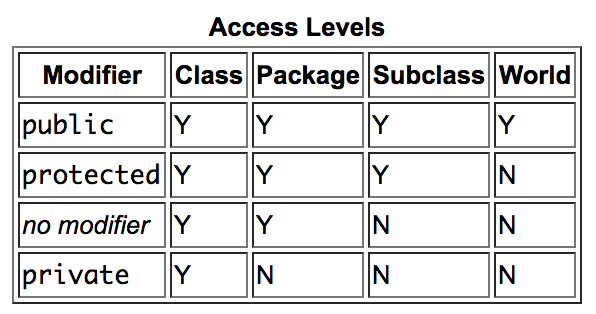

# Things we did this week - Syntax and Examples
----------------
## Class

In C++, a class is a blueprint or a template for creating objects. It's a fundamental concept in object-oriented programming (OOP) that lets you group data (member variables) and the code that operates on that data (member functions) into a single unit.

Here's a breakdown of what a class offers and why it's important:

**Blueprint for objects:** A class defines the properties (data) and behaviors (functions) that objects of that class will share. Imagine a class named Car. It might have member variables like color, model, and speed, and member functions like accelerate(), brake(), and turn().

**Encapsulation:** Classes promote encapsulation, which is the idea of bundling data and the code that manipulates it together. This protects the data from being accessed or modified directly from outside the class, ensuring data integrity. Getters and setters (covered in previous discussions) are mechanisms to achieve controlled access to data.

**Code reusability:** By creating classes, you can reuse the same code structure for similar objects. Imagine multiple car objects in a game. You can create a Car class and create different instances (objects) with specific colors, models, etc., but they'll all share the same functionality defined in the class.

**Improved code organization:** Classes help organize code by grouping related functionalities together. This makes code easier to understand, maintain, and modify.

Classes have a few components, constructors, variables, and methods. Objects are instances of a class. All these components are explained below, but for now if you need to make a class you can copy and paste the below template!

```C++
class ClassName{

public:
// constructor must have the same name as the class
    ClassName()
// methods (e.g. getters and setters) and other member functions

//getters and setters explained in more detail below
void setValue (int value1);
int getValue(void);
otherMemberFunctions();

private: 
//private values are, by convention followed by an underscore
    int value1_;
    bool value2_;
    double value3_;
    char value4_;

protected:

}
```

## Constructor
A C++ class constructor is a special member function that is automatically called whenever you create an object of that class. Its main role is to:

**Initialize member variables:** Constructors ensure that objects start in a well-defined state by assigning initial values to their member variables.

**Allocate memory (if needed):** For objects that require memory allocation, constructors handle this task during object creation.

The constructor must always have the same name as the class.

```C++
class ClassName(){

public: 
ClassName(); // <-- this is your constructor


// If you want to initialise variables you can also have arguments in the constructor
ClassName(int value1, double value2, bool value3);
}

```

## Object (Instance of Class)
A C++ class object is a self-contained unit that combines data (member variables) and the functions (member methods) that operate on that data. It's like a specific instance created from a class blueprint.  

This allows you to create multiple objects with the same functionalities but potentially different data.


## Access Specifiers and their role in setting the accessibility of classes, methods, and other members (guaranteeing encapsulation)

In C++, access specifiers define the visibility and accessibility of class members (data and functions) throughout your program. They play a vital role in achieving encapsulation, a core principle of object-oriented programming.

There are three primary access specifiers:

**Public:** Members declared as public are accessible from anywhere in your program, allowing direct use.

**Private:** Members declared as private are only accessible by member functions within the same class. This hides the data implementation details, promoting encapsulation.

**Protected:** Members declared as protected are accessible within the class and also by inherited classes (derived from the original class). This is useful for sharing implementation details within a class hierarchy.


By carefully choosing access specifiers, you control how the internal workings of your class are accessed and modified, ensuring data integrity and promoting better code organization. This is the essence of encapsulation in C++.




## Member functions (in other OO languages also called methods)
Member functions exist within classes

```C++

class ClassName{
    public:
    //Methods generally go here! 
    //(especially getters and setters - explained below)
    private:
}
```

Two very common method types are get methods and set methods, also known as getters and setters. 

**<u>Getter Methods:</u>**

**Member function**: It's a function defined within a class that can access the class's private members.

**Controlled access**: Getters allow you to retrieve the value of a private member variable but often don't allow direct modification.

**Private data member**: These are variables declared inside the class with the private access specifier. They are only accessible by member functions of the class, promoting encapsulation.

**Syntax:**
Generally, does not take any input paramters but provides a return value
```C++

class ClassName{
public:
/*the following examples show implementation and definition(?) of the methods.
Generally the initialisation happens in the .h file and then functionality is defined in the .cpp file*/
    ClassName(); //default constructor
    int getMethodInt(void){
        return value1_;
    }
    bool getMethodBool (void){
        return value2_;
    }
    double getMethodDouble(void){
        return value3_; 
    }

private:
    int value1_;
    bool value2_;
    double value3_;
}
```
**Remember!** Your return value **MUST** be of the same type as the function!

**<u>Setter Methods:</u>**

**Member function:** 
Similar to getters, setters are also defined within a class and have access to its private members.

**Modify private data:**
 Unlike getters, setters take an argument (usually the new value) and assign it to the private data member.

**Controlled modification:** 
Setters provide a controlled way to update private data, potentially adding validation or other logic before modifying the value.

```C++
Class ClassName {
public:
    ClassName(); //default constructor
    void setMethodInt(int value1){
       value1_ = value1
    }
    void setMethodBool (bool value2){
        value2_ = value2
    }
    void setMethodDouble(double value3){
         value3_ = value3
    }
private:
    int value1_;
    bool value2_;
    double value3_;
}

```

You can also have all other manner of member functions but getters and setters are a good starting point and are frequently used!


## Member variables
C++ member variables are variables that are defined inside a class. They represent the data (properties) associated with objects (instances) of that class.

There are two main types:

**Instance variables:** These are unique to each object. Every object of the class will have its own copy of the member variable with potentially different values.

**Static variables:** There's only one copy of a static member variable shared by all objects of the class.


# Module Summary Questions


## 1. Create a new class on Ubuntu via Visual Studio IDE


## 2. Determine what should be placed as private and public inside a class


## 3. Understand the role of the constructor


## 4. Understand what an object of a class contains


